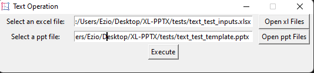

# About
----

XL-PPTX is a software that is focused to be used in all the field but especially in the corporate field where bulk amount of  Power Point slides information needs to be replaced in a short duration. 

**For example:** In your corporation you have 10-20 Power Point files containing 10-15 slides per file. In those file *Year 2020*  is defined but your superior wants them to be  *Year 2022* and also some other information that should be changed in a short duration of time. If you have familiarity with Power Point you will think that it can be done with Power Point's built in `find & replace` but think if you have 20 information then this `find & replace` procedure will be cumbersome. In this case you can automate your task using this software. 

**Note:** The `application` can be found in the `dist/` directory named `xl_pptx_v1.6.exe` and this is only released for `windows`. Also, all the test files can be found in the `tests/` directory. 


# How To
---

## Text Operation

1. First, open the application and select the `Text` by clicking the button.

2. You'll be prompted with a new layout.

   

3. From text operation GUI select a MS-Excel file containing `.xlsx` extension by clicking `Open xl Files`. This *Excel* file will be used as your input to the template.

4. Inside the *Excel* file.

   

4. Also, select a MS-PowerPoint file containing `.pptx` extension. Basically, this *PowerPoint* file will be used as your template.

5. Inside the *PowerPoint* file. There will be some `text field` holding the **id** that has been defined in the `Excel` file.

   

6. After the selection of all the appropriate files, it will look something like this.

   

7. Then press the `Execute` button and there will be a `output.pptx` file.

   

8. Note that the `output.pptx` file will always be where the application file was ran from. That means if I ran the `application` fille from `C:/Users/Ezio/Desktop/` then the `output.pptx` will be in the same location. Also, if you have more than one slide in the *PowerPoint* file this `application` is capable enough to find and replace in the whole document.

## Image Operation 

1. First, open the application and select the `Image` by clicking the button.

2. You'll be prompted with a new layout.

   

3. From Image operation GUI select a MS-Excel file containing `.xlsx` extension by clicking `Open xl Files`. This *Excel* file will be used as your input to the template and in this *Excel* file will contain images.

4. Inside the *Excel* file.

   

5. Also, select a MS-PowerPoint file containing `.pptx` extension. Basically, this *PowerPoint* file will be used as your template.

6. You have to specify the **id** of a particular image inside your given template file. To do that `Home -> Select -> Selection Pane`. You will find a `text field` and you should define the image **id** there. In step 7 a tutorial has been given.

7. Inside the *PowerPoint* file.

   		

8. After the selection of all the appropriate files, it will look something like this.

   

9. Then press the `Execute` button and there will be a `output.pptx` file.
10. Inside `output.pptx` file.


11. Note that the `output.pptx` file will always be where the application file was ran from. That means if I ran the `application` fille from `C:/Users/Ezio/Desktop/` then the `output.pptx` will be in the same location. Also, if you have more than one slide in the *PowerPoint* file this `application` is capable enough to find and replace in the whole document.

# Informations for the Geek

---

Python modules and libraries that were used:

* tkinter
* openpyxl
* openpyxl-image-loader
* python-pptx

Custom module information: 

* `GUI.py` the main layout

* `image_top.py` layout for image operation
* `text_top.py` layout for text operation

* `image_functions.py` all the necessary functions for image operations

* `text_functions.py` all the necessary function for text operations

# Build procedure

1. Install the libraries.

   ```
   pip install tk openpyxl python-pptx openpyxl-image-loader nuitka zstandard ordered-set
   ```

2. Notice that we are using `nuitka` as our python compiler and `zstandard` for compressing the binary.

3. For building run `nuitka` with appropriate flags like below.

   ```
   python -m nuitka --follow-imports --standalone --onefile --enable-plugin=tk-inter --windows-disable-console --windows-icon-from-ico=./logo.ico ./GUI.py
   ```
